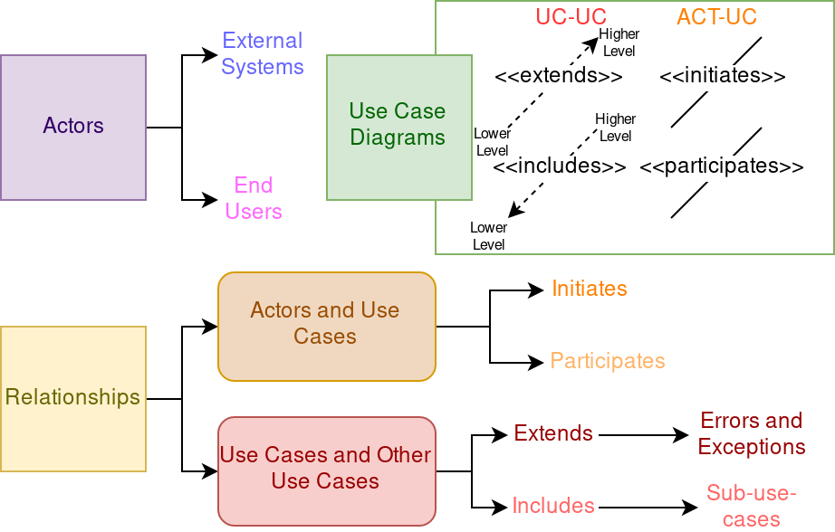
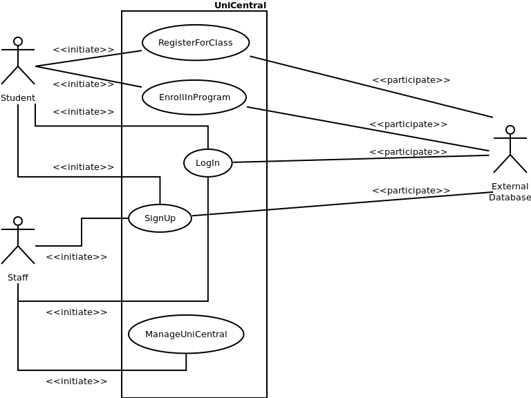
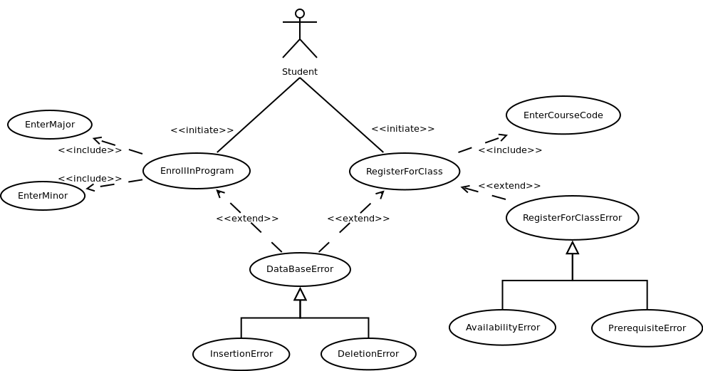
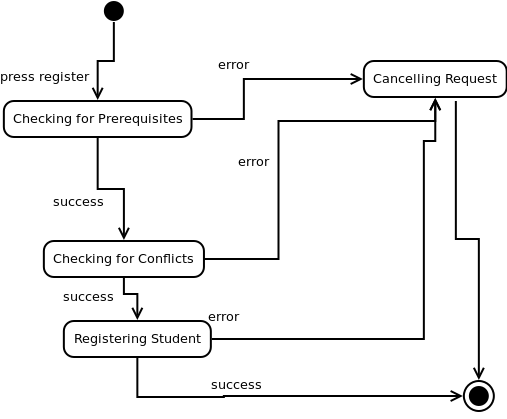
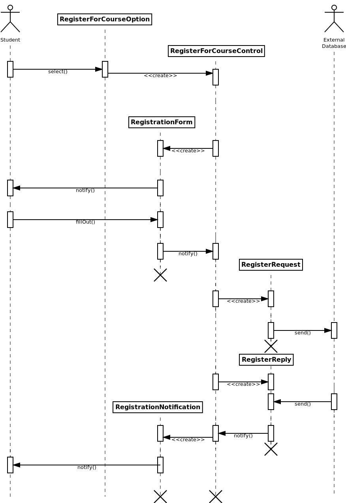
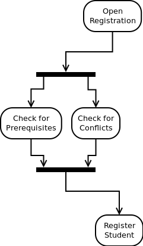
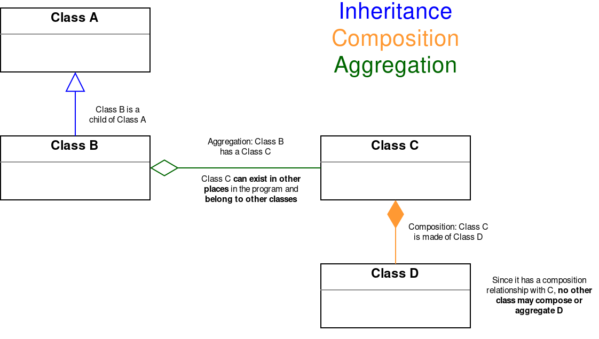

---
author: |
  | William Findlay
title: |
  | COMP3004 Midterm Notes
date: \today
bibliography: /home/housedhorse/.bibs/uni.bib
csl: /home/housedhorse/.bibs/ieee.csl
subparagraph: yes
header-includes: |
  ```{=latex}
  \usepackage{float}
  \usepackage{listings}
  \usepackage[hang,bf]{caption}
  \usepackage{framed}
  \usepackage[section]{placeins}

  \usepackage[dvipsnames,table]{xcolor}

  \usepackage{pifont}

  \allowdisplaybreaks

  % fancy headers/footers
  \makeatletter
  \usepackage{fancyhdr}
  \lhead{\@author}
  \chead{}
  \rhead{\@title}
  \lfoot{}
  \cfoot{\thepage}
  \rfoot{}
  \renewcommand{\headrulewidth}{0.4pt}

  \usepackage{amsmath, amsfonts,amssymb, amsthm}
  \usepackage{siunitx}
  \usepackage[boxruled,lined,linesnumbered,titlenumbered]{algorithm2e}

  \usepackage{setspace}
  \usepackage{changepage}
  \usepackage[explicit]{titlesec}
  \usepackage{aliascnt}

  \floatplacement{figure}{!htbp}
  \floatplacement{table}{!htbp}
  \lstset{numbers=left,breaklines=true,frame=single,language=Python,captionpos=t,abovecaptionskip={\abovecaptionskip},
  belowcaptionskip={0.5em},aboveskip=\intextsep,showstringspaces=false,identifierstyle=\color{Blue},
  commentstyle={\color{OliveGreen}},keywordstyle={\bfseries\color{Orange}}}
  \setlength{\captionmargin}{1in}

  \newgeometry{margin=1in}

  \newtheoremstyle{plain}
  {12pt}   % ABOVESPACE
  {12pt}   % BELOWSPACE
  {\itshape}  % BODYFONT
  {0pt}       % INDENT (empty value is the same as 0pt)
  {\bfseries} % HEADFONT
  {.}         % HEADPUNCT
  {5pt plus 1pt minus 1pt} % HEADSPACE
  {}          % CUSTOM-HEAD-SPEC

  \newtheoremstyle{definition}
  {12pt}   % ABOVESPACE
  {12pt}   % BELOWSPACE
  {\normalfont}  % BODYFONT
  {0pt}       % INDENT (empty value is the same as 0pt)
  {\bfseries} % HEADFONT
  {.}         % HEADPUNCT
  {5pt plus 1pt minus 1pt} % HEADSPACE
  {}          % CUSTOM-HEAD-SPEC

  \newtheoremstyle{remark}
  {12pt}   % ABOVESPACE
  {12pt}   % BELOWSPACE
  {\normalfont}  % BODYFONT
  {0pt}       % INDENT (empty value is the same as 0pt)
  {\itshape} % HEADFONT
  {.}         % HEADPUNCT
  {5pt plus 1pt minus 1pt} % HEADSPACE
  {}          % CUSTOM-HEAD-SPEC

  \theoremstyle{plain}

  % define theorem
  \newtheorem{theorem}{Theorem}[section]
  \providecommand*{\theoremautorefname}{Theorem}

  % define lemma
  \newtheorem{lemma}{Lemma}[section]
  \providecommand*{\lemmaautorefname}{Lemma}

  % define claim
  \newtheorem{claim}{Claim}[section]
  \providecommand*{\claimautorefname}{Claim}

  % define corollary
  \newtheorem{corollary}{Corollary}[section]
  \providecommand*{\corollaryautorefname}{Corollary}

  % define proposition
  \newtheorem{proposition}{Proposition}[section]
  \providecommand*{\propositionautorefname}{Proposition}

  % define conjecture
  \newtheorem{conjecture}{Conjecture}[section]
  \providecommand*{\conjectureautorefname}{Conjecture}

  \theoremstyle{remark}

  % define observation
  \newtheorem{observation}{Observation}[section]
  \providecommand*{\observationautorefname}{Observation}

  % define remark
  \newtheorem{remark}{Remark}[section]
  \providecommand*{\remarkautorefname}{Remark}

  \theoremstyle{definition}

  % define example
  \newtheorem{example}{Example}[section]
  \providecommand*{\exampleautorefname}{Example}

  % define definition
  \newtheorem{definition}{Definition}[section]
  \providecommand*{\definitionautorefname}{Definition}

  \newcommand{\blackbox}{\hfill$\blacksquare$}
  \usepackage{tikz}
  \newcommand*\circled[1]{\tikz[baseline=(char.base)]{
              \node[shape=circle,draw,inner sep=2pt] (char) {#1};}}

  \renewcommand{\labelitemi}{\large$\bullet$}
  \renewcommand{\labelitemii}{\ding{226}}
  \renewcommand{\labelitemiii}{\tiny$\blacksquare$}
  \renewcommand{\labelitemiv}{\small$\triangleright$}

  \titleformat{\paragraph} % command to change
  [runin]                  % shape  (runin, etc.)
  {\bfseries}              % format (bfseries, itshape, etc.)
  {}                       % label  (thesection, thesubsection, etc.)
  {0em}                    % separation between label and body
  {#1}        % before the body
  [.]                       % after the body

  \titleformat{\subparagraph} % command to change
  [runin]                  % shape  (runin, etc.)
  {\itshape}              % format (bfseries, itshape, etc.)
  {}                       % label  (thesection, thesubsection, etc.)
  {0em}                    % separation between label and body
  {#1}        % before the body
  [.]                       % after the body

  \let\lil\lstinputlisting
  \usepackage{afterpage}
  \hypersetup{colorlinks, allcolors=., urlcolor=blue}

  \usepackage{etoolbox}% http://ctan.org/pkg/etoolbox
  \makeatletter
  \patchcmd{\lst@GLI@}% <command>
    {\def\lst@firstline{#1\relax}}% <search>
    {\def\lst@firstline{#1\relax}\def\lst@firstnumber{#1\relax}}% <replace>
    {\typeout{listings firstnumber=firstline}}% <success>
    {\typeout{listings firstnumber not set}}% <failure>
  \makeatother

  \renewcommand\lstlistlistingname{List of Listings}
  \usepackage{chngcntr}
  \counterwithin{figure}{section}
  \counterwithin{table}{section}

  \usepackage{booktabs}
  \usepackage{longtable}
  \usepackage{array}
  \usepackage{multirow}
  \usepackage{wrapfig}
  \usepackage{float}
  \usepackage{colortbl}
  \usepackage{pdflscape}
  \usepackage{tabu}
  \usepackage{threeparttable}
  \usepackage{threeparttablex}
  \usepackage[normalem]{ulem}
  \usepackage{makecell}
  \pagestyle{fancy}

  \renewcommand{\sectionautorefname}{Section}
  \renewcommand{\subsectionautorefname}{Subection}
  \renewcommand{\subsubsectionautorefname}{Subection}
  \renewcommand{\paragraph}{Paragraph}
  \renewcommand{\subparagraph}{Subparagraph}
  ```
output:
  pdf_document:
    number_sections: true
    fig_crop: true
    fig_caption: true
    keep_tex: false
---
```{r,include=FALSE}
knitr::opts_chunk$set(echo = FALSE)
options(kableExtra.latex.load_packages = FALSE)
library(kableExtra)
```
\thispagestyle{empty}
\counterwithin{lstlisting}{section}
\newpage
\pagenumbering{roman}
\thispagestyle{plain}
\tableofcontents
\newpage
\thispagestyle{plain}
\listoffigures
\listoftables
\lstlistoflistings
\newpage
\pagenumbering{arabic}
\setcounter{page}{1}

# Software Engineering

- what is it?
  - requirements analysis
  - building a *software system*
- why is it necessary?
  - systems get huge and difficult to manage
  - we need a plan
  - *reliability*
  - *modifiability*


# Build Models

- what is a model?
  - representation of how to build system
  - get a better idea of how to do it
  - clarify requirements

## Functional Model (Elicitation)
- use case diagrams
- use case tables
- FR, NFR tables

### Use Cases (Tables and Diagrams)

- see \autoref{uc-chart} for components of use case diagrams and tables
- see \autoref{uc-ex1} for an example high level use case diagram
- see \autoref{uc-ex2} for an example detailed use case diagram
- see \autoref{uc-ex3} and \autoref{uc-ex4} for example use case tables

{width=80%}

{height=50%}

{height=50%}

\FloatBarrier

\begin{table}
\caption{An example use case table for a high level use case.}
\label{uc-ex3}
\centering
\includegraphics[width=.8\textwidth]{tables/registerforclass.png}
\end{table}

\begin{table}
\caption{An example use case table for an extend use case.}
\label{uc-ex4}
\centering
\includegraphics[width=.8\textwidth]{tables/registerforclasserror.png}
\end{table}

\FloatBarrier

\newpage

### FURPS+ Requirements (Tables)

**F**unctional\
**U**sability\
**R**eliability\
**P**erformance\
**S**upportability\
**+** Operation, Interface, Implementation, Packaging, Legal

- types of requirements
  - functional
    - what can the actors do?
  - usability
    - ease of use requirements
    - measurable, specific
  - reliability
    - recovery from error
    - stability
    - security
  - performance
    - how the system performs under certain conditions
    - specific, quantifiable
    - realistic
  - supportability
    - what kinds of platforms/hardware can the system run on
    - ability for future maintenance
  - implementation
    - implementation-specific requirements
  - interface
    - how the system interacts with the actors
    - UI stuff that doesn't fall under usability
    - how it interfaces with external systems
  - operation
    - which users are allowed to do what
    - constraints on operation
  - packaging
    - how the system should be delivered to the customer
  - legal
    - any legal restrictions on the software


- see \autoref{fr} for a functional requirements table
- see \autoref{nfr} for a non-functional requirements table

\FloatBarrier

\begin{table}
\caption{An example functional requirements table.}
\label{fr}
\centering
\includegraphics[width=.8\textwidth]{tables/fr.png}
\end{table}

\begin{table}
\caption{An example non-functional requirements table.}
\label{nfr}
\centering
\includegraphics[width=.8\textwidth]{tables/nfr.png}
\end{table}

\FloatBarrier

## Dynamic Model (Analysis)

- state machines
- sequence diagrams
- activity diagrams

### State Machines

- initial state
  - dark circle
- other states
  - bubbles with verb phrases
- transitions with labels
  - "from initial" or "to final" optionally has no label
- final state
  - dark circle surrounded by light circle
  - looks like a target
- \autoref{state-machine} for an example

{height=80%}

\FloatBarrier

### Sequence Diagrams

{height=90%}

\FloatBarrier

### Activity Diagrams

{height=30%}

\FloatBarrier

## Object Model (Analysis)

### Class Diagrams



\FloatBarrier

### Data Dictionaries

## Traceability

- required changes?
  - traceability lets us figure out *what parts are affected*
- numbers on all table rows
  - FR-01, ...
  - NFR-01, ...
  - UC-01, ...


# Software Development Life Cycle

\color{Violet} 
1. Requirements Elicitation
1. Analysis 

\vspace{-2em}
\color{black}
\hspace{1.5em}\sout{\hfill} Client Knowledge Disappears \hfill \hfill \hfill

\color{NavyBlue}
3. High Level System Design
1. Detailed Object Design \color{ForestGreen}
1. Implementation

\vspace{-2em}
\color{black}
\hspace{1.5em}\sout{\hfill} Client Knowledge Reappears \hfill \hfill \hfill

\color{ForestGreen}

6. Testing
1. Deployment and Maintenance

\color{black} 


# Requirements Elicitation
- what does the client want?
- requirements (FURPS+)
  - functional
    - what do the actors do?
  - non-functional
    - constraints
    - quality requirements
- scenarios, use cases
- work products
  - functional model
    - FR, NFR
    - use case diagrams


# Analysis
- work products
  - object model
    - class diagrams
  - dynamic model
    - sequence diagrams
    - state machine diagrams
    - activity diagrams


# High Level System Design
